<p align="center">
  
</p>

<h1 align="center">RoadSOS</h1>

<p align="center">
  <b>Road Accident Emergency Response System</b><br/>
  <i>A mobile-first emergency response platform (React Native + Expo) that puts critical emergency resources within one tap — online or offline.</i>
</p>

<p align="center">
  <a href="#"></a>
  <a href="#"></a>
  <a href="#"></a>
  <a href="#"></a>
  <a href="#"></a>
  <a href="LICENSE"></a>
</p>

---

## 📌 Table of Contents
1. [Problem Statement](#1-problem-statement)
2. [Solution Overview](#2-solution-overview)
3. [📱 Visual Walkthrough (Screenshots)](#-visual-walkthrough-screenshots)
4. [⚙️ System Architecture](#3-system-architecture)
   - [Tech Stack Overview](#31-tech-stack-overview)
   - [High-Level Data Flow](#32-high-level-data-flow)
5. [🛡️ Core Features — Implementation Detail](#4-core-features--implementation-detail)
   - [One-Tap Emergency Mode (SOS Button)](#41-one-tap-emergency-mode-sos-button)
   - [Live Nearby Emergency Locator](#42-live-nearby-emergency-locator)
   - [Instant Calling](#43-instant-calling)
   - [Offline Emergency Mode](#44-offline-emergency-mode)
   - [Emergency Contact Alert](#45-emergency-contact-alert)
   - [Quick Accident Report](#46-quick-accident-report)
6. [💡 Unique & Innovative Features](#5-unique--innovative-features--implementation-detail)
   - [Sensor-Based Accident Detection](#51-accident-detection-via-sensors)
   - [AI First Aid Assistant (Gemini API)](#52-ai-first-aid-assistant-gemini-api)
   - [Multi-Language Voice Support](#53-multi-language-voice-support)
   - [Offline SMS SOS Engine](#54-sms-sos-without-internet)
   - [AI Image Analysis (Gemini Vision)](#55-ai-image-analysis-gemini-vision)
   - [Crowd Assistance Mode](#56-crowd-assistance-mode)
   - [Traffic-Aware Hospital Recommendations](#57-traffic-aware-hospital-recommendation)
7. [⚠️ Key Risks & Mitigations](#6-key-risks--mitigations)
8. [📄 License](#-license)

---

## 1. Problem Statement

India records over **1,50,000 road accident deaths annually** — one every 4 minutes. When accidents occur, victims and bystanders face a critical bottleneck: quickly finding and reaching emergency services during the **'golden hour'** — the crucial 60-minute window where timely medical care directly determines survival.

### Key Pain Points:
* 🚨 **Fragmented Directory:** No single platform combines trauma centres, ambulances, police, and vehicle rescue services.
* 📍 **Static Systems:** Emergency numbers are not location-aware or context-aware.
* 📶 **Offline Bottlenecks:** Poor network coverage in rural India prevents app-based help at the moment it's needed most.
* 😨 **Bystander Hesitancy:** Bystanders often freeze due to a lack of immediate, trustworthy first-aid guidance.

---

## 2. Solution Overview

**ROADSoS** is a mobile-first emergency response platform (**React Native + Expo**) that puts every critical emergency resource within one tap — even when fully offline. It combines real-time location intelligence, AI-powered decision support, sensor-based accident detection, and multilingual voice guidance to serve India's diverse population across urban and rural contexts.

### Core Value Proposition:
* ⚡ **One-Tap SOS:** Immediately find and connect to nearest hospital, ambulance, police, or towing service — in under 3 seconds.
* 📡 **Full Offline Mode:** Pre-loaded SQLite databases, offline map tiles, local medical profiles, and automatic SMS triggers guarantee operation without internet.
* 🤖 **AI Accident Severity Detection:** Leverages Gemini 1.5 Flash Vision for image-based severity analysis and on-device TFLite accelerometer analysis.
* 🗣️ **Multilingual Voice Support:** Provides speech guidance in **English, Hindi, Marathi, Tamil, and Bengali** to bypass language barriers.
* 👥 **Crowd-Sourced Bystander Network:** Automatically notifies nearby ROADSoS users to assist in remote areas where services may have delayed ETAs.

---

## 📱 Visual Walkthrough (Screenshots)

### 🚨 1. Emergency SOS & Helplines (Home Screen)
Provides a giant, one-tap red SOS button, continuous background crash sensor tracking toggle, medical ID quick-access cards, and unified national helplines.

<table align="center">
  <tr>
    <td align="center" width="50%">
      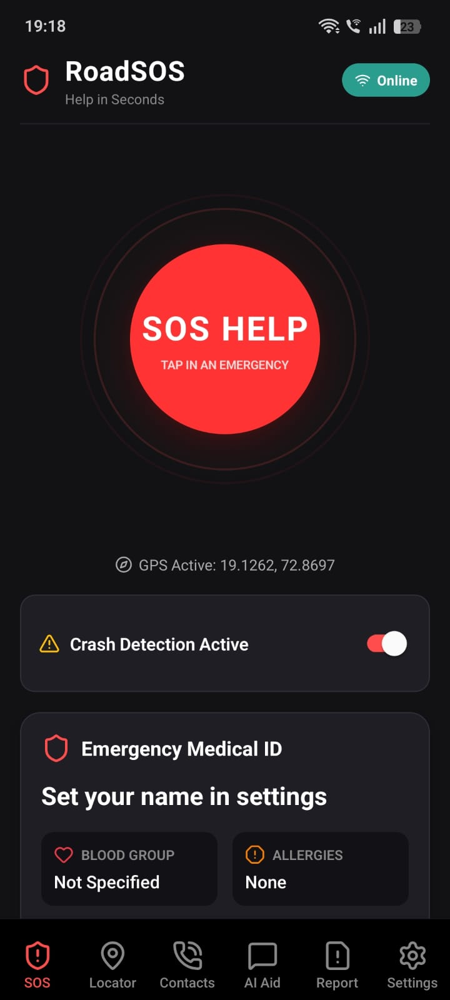<br/>
      <b>SOS Home (Top Panel)</b>
    </td>
    <td align="center" width="50%">
      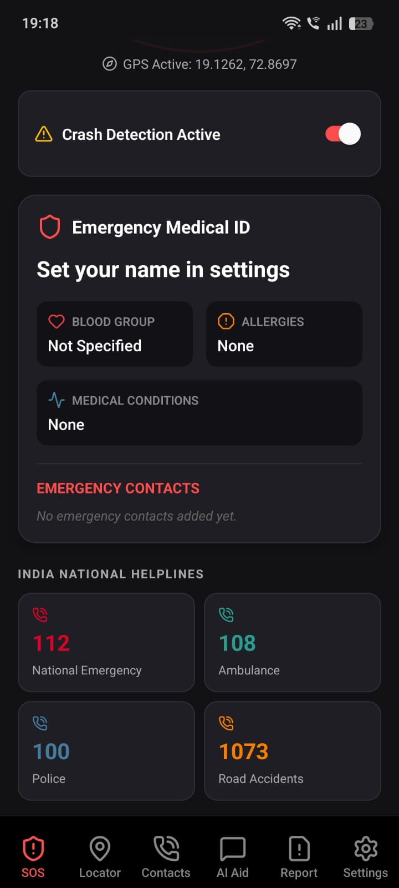<br/>
      <b>SOS Home (Bottom Helplines)</b>
    </td>
  </tr>
</table>

---

### 📍 2. Live Locator, List & Route Navigation
Interactive dark-themed map and list views showing nearby trauma centres, ambulances, police, and towing services sorted by ETA. Feature includes traffic-aware active turn-by-turn navigation.

<table align="center">
  <tr>
    <td align="center" width="33%">
      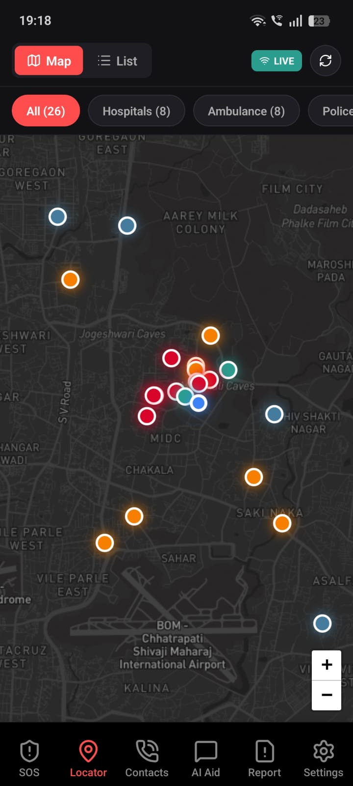<br/>
      <b>Emergency Map View</b>
    </td>
    <td align="center" width="33%">
      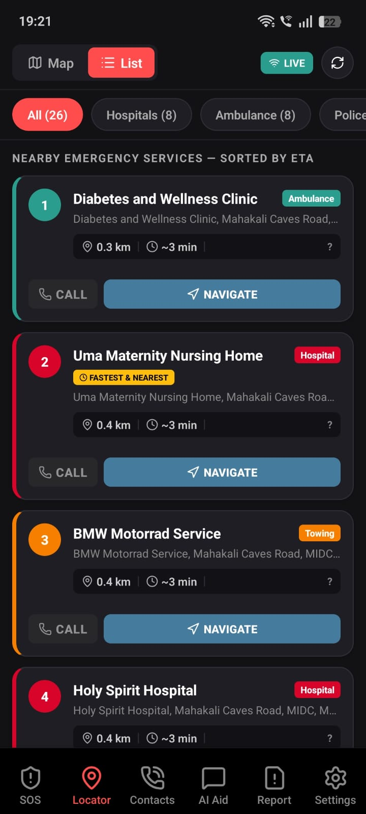<br/>
      <b>Emergency Services List (Sorted by ETA)</b>
    </td>
    <td align="center" width="33%">
      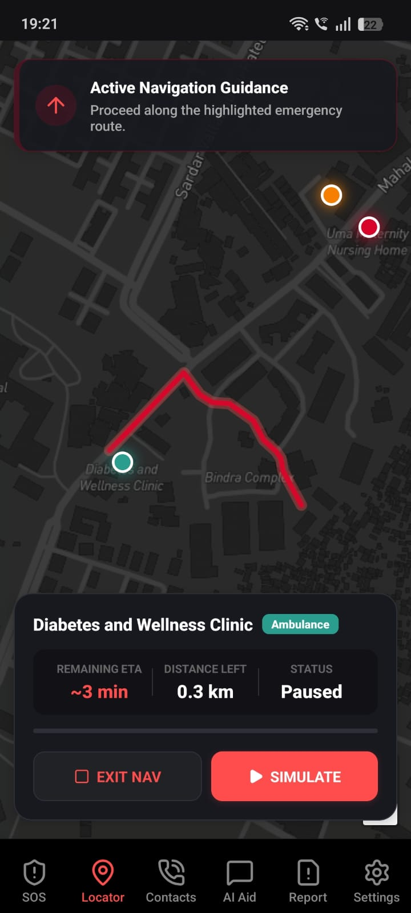<br/>
      <b>Active Emergency Navigation</b>
    </td>
  </tr>
</table>

---

### 🤖 3. AI Assistant & Crash Severity Analyzer
Includes step-by-step AI-powered first-aid guides (Gemini 1.5 Flash), an interactive pulsing CPR metronome to guide CPR pace at the scene, and an AI vision model to analyze crash severity from photos.

<table align="center">
  <tr>
    <td align="center" width="33%">
      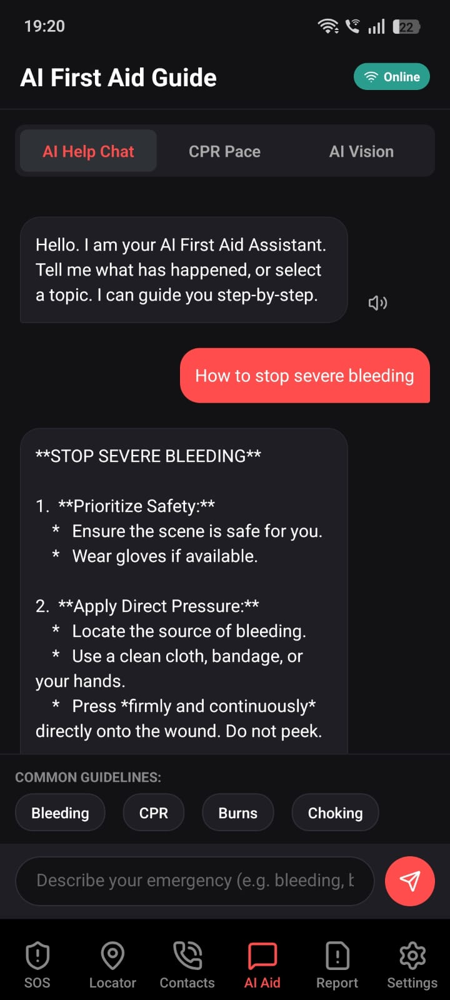<br/>
      <b>Step-by-Step AI First-Aid Guide</b>
    </td>
    <td align="center" width="33%">
      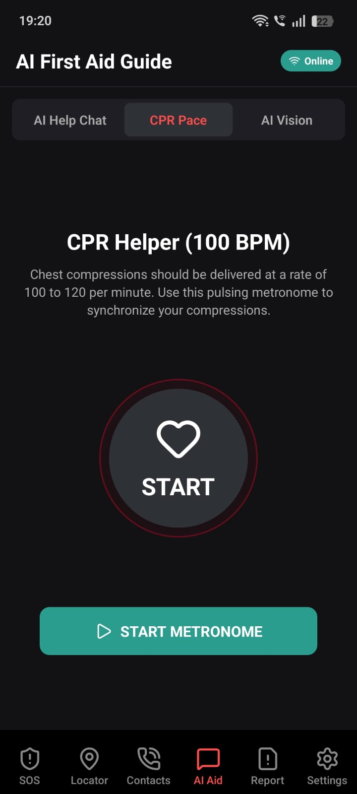<br/>
      <b>Pulsing CPR Metronome (100 BPM)</b>
    </td>
    <td align="center" width="33%">
      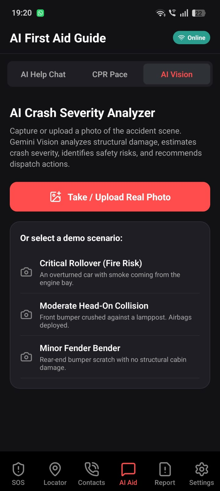<br/>
      <b>AI Crash Severity Analyzer</b>
    </td>
  </tr>
</table>

---

### 📋 4. Contacts & Quick Accident Report
Manage unified helplines, custom emergency contacts, and file rapid-fire structured accident reports with auto-filled details to immediately brief dispatchers and hospitals.

<table align="center">
  <tr>
    <td align="center" width="33%">
      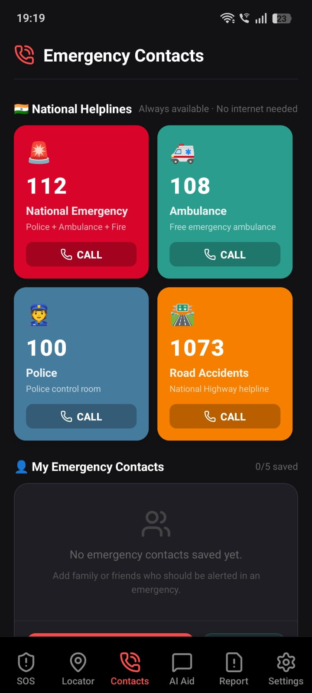<br/>
      <b>National Helplines</b>
    </td>
    <td align="center" width="33%">
      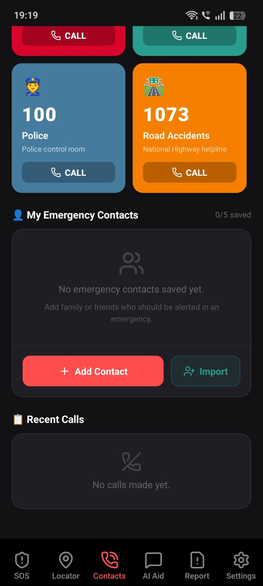<br/>
      <b>Custom Emergency Contacts</b>
    </td>
    <td align="center" width="33%">
      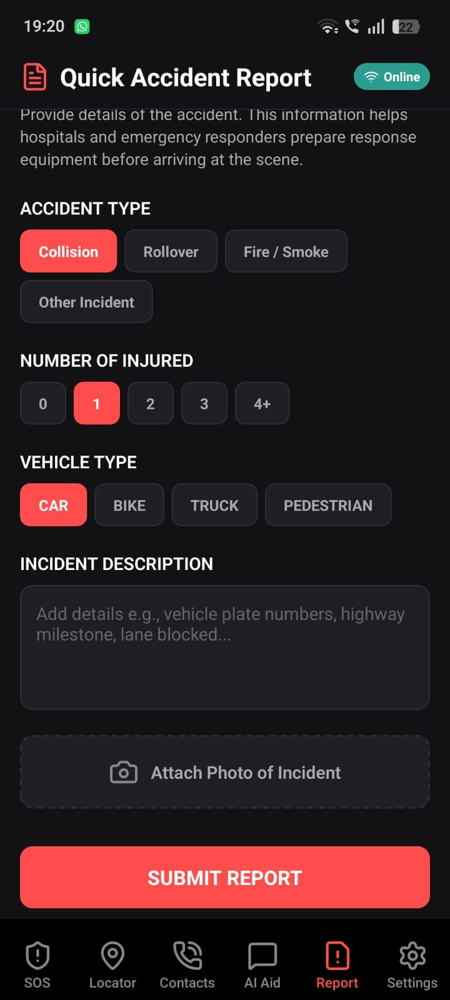<br/>
      <b>Quick Accident Report Form</b>
    </td>
  </tr>
</table>

---

### ⚙️ 5. User Settings & App Configurations
Configure personal medical details (Blood group, Allergies, Conditions), language preferences, and fine-tune crash sensor G-force thresholds with integrated crash simulation triggers.

<table align="center">
  <tr>
    <td align="center" width="50%">
      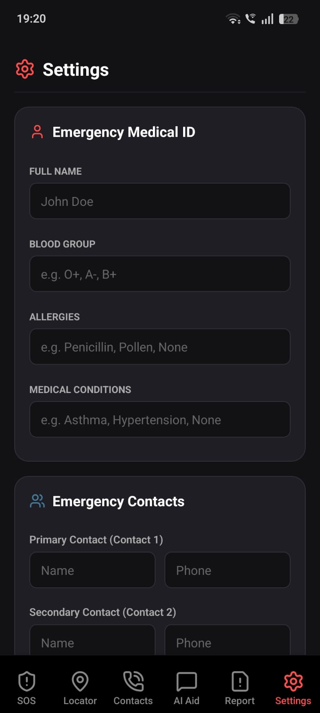<br/>
      <b>Emergency Medical ID Profile</b>
    </td>
    <td align="center" width="50%">
      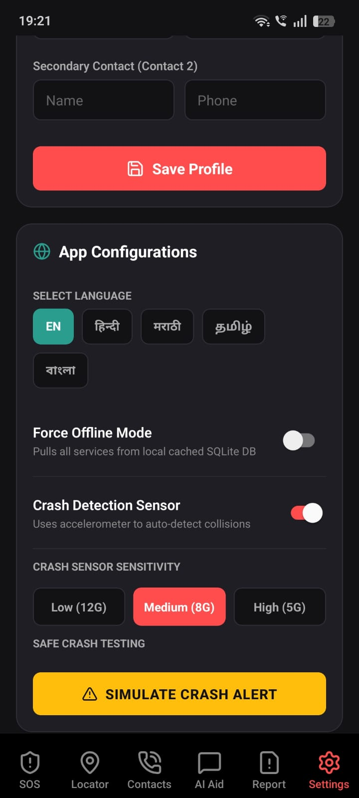<br/>
      <b>Sensors, Language & Offline Configurations</b>
    </td>
  </tr>
</table>

---

## 3. System Architecture

ROADSoS is engineered for high resilience, emphasizing offline availability and immediate data delivery under extreme constraints.

### 3.1 Tech Stack Overview

| Layer | Tech Stack Components | Purpose / Role |
| :--- | :--- | :--- |
| **Frontend** | React Native, Expo SDK (v51+), TypeScript | Core cross-platform mobile app codebase (iOS & Android) |
| **Maps & Navigation** | Google Maps SDK, MapTiler Offline Tiles | Real-time routing, active turn-by-turn guidance, offline maps |
| **Backend & Auth** | Node.js, Express, Firebase Auth (OTP Phone Auth) | Backend server REST APIs, secure OTP-based mobile registration |
| **AI / ML** | Gemini 1.5 Flash API, TensorFlow Lite (On-device) | First-Aid advisory system, image analysis, crash impact classification |
| **Offline Engine** | SQLite (via `expo-sqlite`), `expo-sms`, MapTiler Tiles | SQLite regional caching, offline map rendering, offline fallback SMS |
| **Accident Detection** | Accelerometer, G-force monitoring (`expo-sensors`) | Continuous, battery-optimized background telemetry capture |
| **Notifications** | Firebase Cloud Messaging (FCM), Twilio API | Real-time push, peer crowd-alerts, fallback SMS delivery |
| **Voice & Localization**| `expo-speech`, `i18next` | TTS-guided instructions, multi-language system translation |
| **Storage** | Firebase Storage, `AsyncStorage` | Remote image uploads, persistent offline medical profile |

### 3.2 High-Level Data Flow

```mermaid
graph TD
    %% Base Trigger Styles
    classDef default fill:#1a1c1e,stroke:#3a3d40,color:#fff;
    classDef redTrigger fill:#8b0000,stroke:#ff3333,color:#fff,stroke-width:2px;
    classDef blueService fill:#004080,stroke:#3399ff,color:#fff,stroke-width:1px;
    classDef greenService fill:#006400,stroke:#33cc33,color:#fff,stroke-width:1px;

    A[User Presses SOS / Accelerometer Impact > 3G] :::redTrigger --> B{Check Network Status}
    
    %% Online Route
    B -- Online --> C[Google Places & Maps SDK] :::blueService
    C --> D[Rank trauma centres by real-time ETA via Google Routes API]
    D --> E[Display Maps with interactive routing & navigation]
    
    %% Offline Route
    B -- Offline --> F[Read SQLite cache pre-populated within 50km] :::greenService
    F --> G[Render offline MapTiler tiles & pre-computed nearest services]
    G --> H[Display offline navigation using cached coordinates]

    %% Alert Dispatch
    A --> I{Network Available?}
    I -- Yes --> J[Send FCM Push with Live Location link to Contacts]
    I -- No --> K[Send automated native SMS with GPS coordinates via expo-sms] :::redTrigger
    
    %% AI Assistance
    L[AI First Aid / Image Analysis] --> M{Network Available?}
    M -- Yes --> N[Stream from Gemini 1.5 Flash / Vision API]
    M -- No --> O[Pulls offline emergency first-aid guides from SQLite]
```

---

## 4. Core Features — Implementation Detail

### 4.1 One-Tap Emergency Mode (SOS Button)
* **Instant Activation:** Features a giant, central Red SOS Button optimized for high-stress usage.
* **Telemetry Capturing:** Instantly queries GPS coordinates via `expo-location` in high-accuracy background mode.
* **Rapid Resolution:** Fires parallel requests to Google Places and Directions API to find nearby trauma centres, police stations, ambulances, and towing services.
* **Execution Target:** Ranks results by absolute ETA (incorporating live traffic data) and displays the closest choices within **2 to 3 seconds**.
* **Offline Resiliency:** Instantly defaults to reading pre-populated local SQLite caches if network connectivity is absent.

### 4.2 Live Nearby Emergency Locator
* **Integrated Mapping:** Powered by Google Maps SDK with Places API and Directions API.
* **Dynamic Resource Cards:** Cards display crucial information: physical distance (km), travel ETA (minutes), instant call button, and facility status (open/closed).
* **Navigation Overlay:** Provides active, turn-by-turn navigation overlay utilizing the Google Routes API.
* **Traffic-Aware Routing:** Prioritizes routes based on traffic speed rather than geographic proximity.

### 4.3 Instant Calling
* **Native Integration:** One-tap calling hooks into `expo-linking` using the native `tel:` protocol.
* **Pre-Populated Emergency Directory:** Pre-loaded with critical national hotlines in India: **112** (unified emergency), **108** (ambulance), **100** (police), and **1073** (road accidents).
* **Custom Speed Dials:** Saved personal emergency contacts are anchored at the top of the interface for rapid dialing.
* **100% Offline Capability:** Native cell-tower-based voice calls operate entirely independent of active mobile data.

### 4.4 Offline Emergency Mode
* **SQLite Offline Database (`expo-sqlite`):** Automatically pre-caches the top 20 emergency clinics, police stations, and towing centers within a 50km radius of the user's trajectory.
* **MapTiler Offline Tiles:** Renders fully-featured maps without internet connectivity by utilizing pre-downloaded regional map chunks.
* **Local Persistence (`AsyncStorage`):** Stores user medical profiles (blood group, conditions), emergency contact lists, and last-known GPS coordinates.
* **Offline SMS Fallback:** Utilizes `expo-sms` to launch structured SMS messages with embedded coordinates, functioning on any 2G cellular carrier.
* **Background Database Sync:** Automatically refreshes the local SQLite cache with updated hospital records once the application detects active internet connection.

### 4.5 Emergency Contact Alert
* **Contact Directory:** Allows the user to store up to 5 emergency contacts in their profile.
* **Real-time Push Alerts:** Fires geocoded Firebase push notifications to contacts featuring a direct Google Maps deeplink.
* **Dynamic Location Tracking:** Employs Firebase Realtime Database to update the victim's location every 30 seconds, allowing contacts to track travel routes.
* **Structured Fallback Message:** Pre-formats offline SMS templates: `EMERGENCY: [Name] needs help. GPS: [Lat, Long]. Time: [HH:MM]`.

### 4.6 Quick Accident Report
* **Structured Report Entry:** A simplified 4-field reporting system: accident type (collision, rollover, fire, or other), headcount of injured parties, vehicle categories, and incident description.
* **Incident Documentation:** Supports instant camera captures or local gallery uploads saved to Firebase Storage.
* **Export & Sharing:** Enables sharing formatted summaries via WhatsApp, native SMS, or email directly to law enforcement and hospitals to prepare triage facilities.

---

## 5. Unique & Innovative Features — Implementation Detail

### 5.1 Accident Detection via Sensors
* **Continuous Background Telemetry:** Employs `expo-sensors` to monitor the device's accelerometer continuously with optimized, low-power background threads.
* **On-Device G-Force Classifier:** Telemetry is fed directly into an on-device TensorFlow Lite model trained on crash signatures.
* **Auto-SOS Trigger:** An acceleration delta greater than **3G** within a **200ms** timeframe launches an interactive modal: `"Are you safe? (YES / NO)"`.
* **Zero-Response Escalation:** If the user fails to respond within a **10-second countdown**, the app automatically executes the SOS routine: broadcasting alerts to emergency contacts and displaying the nearest hospital route.

### 5.2 AI First Aid Assistant (Gemini API)
* **Conversational AI Core:** Uses `Gemini 1.5 Flash` to deliver ultra-fast, contextual, and safety-focused first-aid guidelines.
* **Safety Restrictive System Prompts:** Structured strictly to outline safe, non-invasive bystander actions, always anchoring advice with the prompt to call **108**.
* **CPR Assistance:** Features a dedicated **CPR helper** (visual metronome set to **100 BPM**) to synchronize chest compressions at the scene.
* **Multilingual TTS:** Integrates `expo-speech` to read out instruction cards aloud, allowing hands-free medical assistance during intense situations.
* **Offline Database Fallback:** SQLite caches static medical guidelines for common emergencies (bleeding, CPR, burns, choking) to serve prompt answers when offline.

### 5.3 Multi-Language Voice Support
* **Wide Accessibility:** Fully translated and localized into **English, Hindi, Marathi, Tamil, and Bengali**, covering over **70% of the Indian demographic**.
* **Global i18n Standard:** Implemented using the robust `i18next` framework to synchronize all UI buttons, titles, forms, and placeholders.
* **Automatic Locale Detection:** Detects default device localization parameters to configure language settings on first-boot, with a simple manual override toggle in settings.

### 5.4 SMS SOS Without Internet
* **2G Resiliency:** Operates on basic 2G network signals, circumventing data network failures.
* **Silent Composition:** Pre-composes the SMS to bypass complex UI navigation, allowing one-click transmissions during emergencies.
* **Precision Geocoding:** Fetches cached location telemetry from `expo-location` (updated every 30 seconds in the background) to supply accurate coordinates.

### 5.5 AI Image Analysis (Gemini Vision)
* **Vision Diagnostic Engine:** Employs the `Gemini 1.5 Flash Vision API` to review photos uploaded during Quick Reports.
* **Structured Damage Reports:** Recognizes signs of major danger (e.g. overturned vehicles, fires, trapped occupants) and parses output into structured JSON:
  ```json
  {
    "severity": "critical",
    "risks": ["Fire Hazard", "Blocked Cabin"],
    "recommended": ["Fire Engine", "Ambulance", "Extrication Gear"]
  }
  ```
* **Auto-Fill Integration:** Automatically maps the evaluated severity score directly into the Quick Accident Report form fields to reduce input time.

### 5.6 Crowd Assistance Mode
* **Geofenced Notification Mesh:** Upon SOS trigger, the backend launches real-time geofenced push notifications via Firebase Cloud Messaging to all ROADSoS users within a **2km radius**.
* **Peer-to-Peer Responders:** Broadcasts coordinates to local civilian users: `"Accident reported 800m away — can you assist?"`.
* **Live Triage Tracking:** Civilians clicking `"On My Way"` are tallied on the victim's UI, providing reassurances that crowd-sourced help is en route.

### 5.7 Traffic-Aware Hospital Recommendation
* **Dynamic Route Assessment:** Simultaneously queries Google Routes API for real-time ETAs for the 5 nearest trauma centres.
* **Optimal Transit Recommendations:** Sorts and recommends hospitals based on **travel time (ETA)** rather than pure linear distance.
* **Competitive Edge:** Traditional directories recommend the closest geometric location, which might be blocked by congestion. ROADSoS guides you to the fastest accessible care.

---

## 6. Key Risks & Mitigations

* **Dense Urban GPS Reflections:** High-rise structures can cause GPS drift.
  * *Mitigation:* The application combines `expo-location` with cell-tower and Wi-Fi triangulation models to stabilize precise coordinates.
* **Google API Rate Overages:** Large volumes of map queries could trigger rate limits.
  * *Mitigation:* Implements active query throttling on client-side routing calls and stores all Places coordinates in a temporary local SQLite cache.
* **Gemini API Network Latency:** Slow API streaming under weak cellular networks.
  * *Mitigation:* Uses real-time chunk streaming for chat answers and shows immediate, pre-cached static guidelines while the API responds.
* **Accelerometer False Positives:** Bumps, sudden braking, or dropped phones causing false crash alerts.
  * *Mitigation:* The on-device TFLite model requires a sustained G-force spike of **>3G** across multiple axes lasting over **200ms**, filtered against rapid acceleration drops.
* **Heavy Offline Data Packages:** Extensive offline maps consuming massive storage.
  * *Mitigation:* Users download modular, state-by-state map chunks during initial app onboarding rather than pre-loading the entire subcontinent.
* **SMS Delivery Failures:** Carrier-side SMS delays or drops.
  * *Mitigation:* Employs Firebase FCM as the primary real-time carrier, using multi-channel SMS carriers (Twilio) and native device SMS triggers as independent, parallel fallbacks.

---

## 📄 License

This project is licensed under the MIT License - see the [LICENSE](LICENSE) file for details.